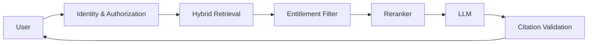
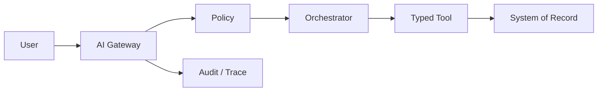

# Architecture examples

## Governed RAG

```mermaid
flowchart LR
    U[User] --> A[Identity & Authorization]
    A --> R[Hybrid Retrieval]
    R --> F[Entitlement Filter]
    F --> RR[Reranker]
    RR --> L[LLM]
    L --> V[Citation Validation]
    V --> U
```

## Governed tool execution

```mermaid
flowchart LR
    U[User] --> G[AI Gateway]
    G --> P[Policy]
    P --> O[Orchestrator]
    O --> T[Typed Tool]
    T --> S[System of Record]
    G --> X[Audit / Trace]
```
