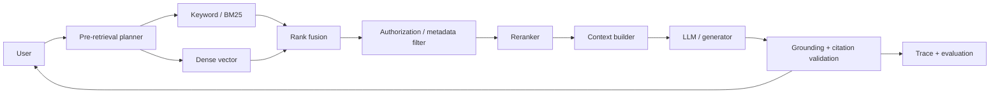
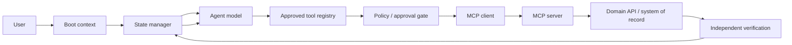
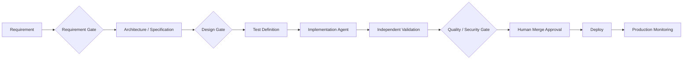

# Architecture examples

## Production RAG

```mermaid
flowchart LR
    U[User] --> P[Pre-retrieval planner]
    P --> K[Keyword / BM25]
    P --> V[Dense vector]
    K --> F[Rank fusion]
    V --> F
    F --> A[Authorization / metadata filter]
    A --> R[Reranker]
    R --> C[Context builder]
    C --> L[LLM / generator]
    L --> G[Grounding + citation validation]
    G --> U
    G --> E[Trace + evaluation]
```

## Governed agent + MCP

```mermaid
flowchart LR
    U[User] --> B[Boot context]
    B --> S[State manager]
    S --> M[Agent model]
    M --> TR[Approved tool registry]
    TR --> P[Policy / approval gate]
    P --> MC[MCP client]
    MC --> MS[MCP server]
    MS --> D[Domain API / system of record]
    D --> V[Independent verification]
    V --> S
    S --> M
```

## AI-assisted SDLC

```mermaid
flowchart LR
    RQ[Requirement] --> RG{Requirement Gate}
    RG --> SP[Architecture / Specification]
    SP --> DG{Design Gate}
    DG --> TD[Test Definition]
    TD --> IM[Implementation Agent]
    IM --> IV[Independent Validation]
    IV --> QG{Quality / Security Gate}
    QG --> HM[Human Merge Approval]
    HM --> DP[Deploy]
    DP --> MON[Production Monitoring]
```
